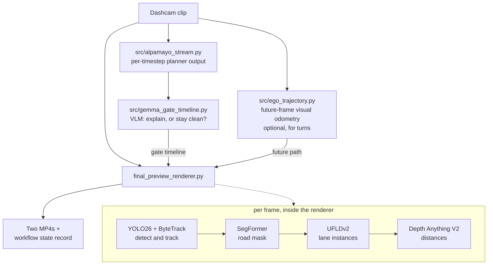

# OptiCarVis

[](https://www.python.org/downloads/)
[](https://docs.astral.sh/uv/)
[](#requirements)
[-76B900)](#requirements)

**Explainable automated-vehicle visualisations, rendered onto real dashcam footage.**

OptiCarVis takes an ordinary dashcam clip and overlays what an automated vehicle
would show a passenger to explain its behaviour: a **future-path ribbon** painted
onto the road surface, and **highlights on the road users it is reacting to**, with
distances. A vision-language model decides *when* an explanation is actually
warranted, so the overlay appears only while it earns its place on screen.


---

## Contents

- [What it produces](#what-it-produces)
- [How it looks](#how-it-looks)
- [How it works](#how-it-works)
- [What shapes the ribbon (the contract)](#what-shapes-the-ribbon-the-contract)
- [Models used](#models-used)
- [Requirements](#requirements)
- [Getting started](#getting-started)
- [Running the pipeline](#running-the-pipeline)
- [Configuration](#configuration)
- [Outputs](#outputs)
- [Known limitations](#known-limitations)
- [Further documentation](#further-documentation)

---

## What it produces

Each render writes **two videos** from one perception pass — one with pedestrians
and cyclists highlighted, one that additionally highlights vehicles — so the two
conditions can be compared in a study without re-running the models.

The overlay is composed of:

| Element | Meaning |
|---|---|
| **Cyan ribbon** | Where the vehicle is going, projected onto the road plane with correct perspective |
| **Flowing chevrons** | Direction arrowheads spaced in world metres that march forward along the path — they foreshorten like real road paint and communicate motion intent |
| **Contour highlights** | The road users the vehicle is reacting to (stable track IDs, temporally smoothed) |
| **Distance labels** | Metric distance from monocular depth, scale-aligned on the road plane |
| **Occlusion** | The ribbon passes *behind* people and vehicles, so it reads as paint on asphalt |
| **Intro / outro animation** | The ribbon draws on and retracts as an explanation starts and ends |

## How it looks

### The ribbon is centred in the ego lane, not in the image

Assuming the vehicle sits at the image centre is wrong on a multi-lane road, and
whenever it rides off-centre in its lane. Lane instances are detected and the ribbon
is anchored between the two boundaries that actually straddle the vehicle.


### Lane detection feeding the ego-lane centre

Detected lane polylines (green) and the ego-lane centre derived from the pair
straddling the vehicle (orange). At intersections there are no longitudinal
markings to follow, confidence collapses, and the ribbon falls back to straight —
by design.


### The ribbon follows a real turn

Through an intersection there are no lane lines to follow, and for a pre-recorded
clip there is no plan to read. The turn is instead reconstructed from the clip's own
future frames by visual odometry, and blended in only while a genuine turn is
detected.


The look-ahead walks the reconstructed path by **distance** (30 m), not time — a
90° turn spans the same metres at any speed, so even a slow intersection turn taken
at walking pace is anticipated and drawn. Below, a real ~80° left turn through an
intersection at ~8 km/h: the bend appears as the turn enters the horizon and the
ribbon sweeps left with the vehicle's actual path.


### The overlay only appears when it is warranted

A vision-language model gates the explanation. Self-evident situations get a clean
pass-through with no overlay at all; the visualisation is reserved for moments a
passenger would actually want explained.


### Occlusion and depth

Road segmentation clips the ribbon to the drivable surface, so it disappears behind
pedestrians instead of being painted over them, and distance labels come from
monocular depth aligned to the road plane.


---

## How it works



**Stages**

1. **Planner stream** (`alpamayo_stream.py`) — produces a per-timestep action and
   reasoning trace from perception, standing in for a live planner.
2. **Explanation gate** (`gemma_gate_timeline.py`) — runs a multimodal VLM over
   sliding windows and decides, per window, whether an explanation is warranted.
   Deliberately conservative: the default answer is *do not explain*.
3. **Ego trajectory** (`ego_trajectory.py`, optional) — planar visual odometry that
   reconstructs the vehicle's real path from the clip's future frames, so the ribbon
   can follow a genuine turn.
4. **Render** (`render_timeline_clip.py` → `final_preview_renderer.py`) — builds the
   ribbon, highlights, occlusion and distance labels, animates the overlay on and
   off per the gate timeline, transcodes to H.264, and records the run.

## What shapes the ribbon (the contract)

Worth reading before changing anything here, because a path overlay that points
where the vehicle is **not** going is worse than no overlay at all.

How a frame becomes a ribbon — lane polylines, the straddle pick with its width
gate, the tracked anchor projected as a ground line converging on the vanishing
point, and the final composite:


| Aspect | Source | Notes |
|---|---|---|
| **Lateral placement** (near end) | Lane instances (UFLDv2) | Which lane the vehicle is in. Gated on a plausible lane width and on detection confidence; falls back to straight when unsure. |
| **Direction** | The vanishing point, at the horizon | The ribbon is the exact image of a straight ground line: its offset from the vanishing column shrinks in proportion to `(v - HORIZON_V)`, reaching zero only **at the horizon**. Because the ribbon stops short of the horizon, its far end still holds part of the near-end offset. Collapsing it onto the vanishing column at the ribbon's far end instead — or easing between the two with a smoothstep — bends the ribbon out of the ego lane toward the middle of the road. Steering the far end from the road-mask centroid or the lane detector's noisy far column had the same effect for different reasons. Do not reintroduce any of these. |
| **Curvature** | Lane-curve fit + visual odometry | Two sources, both bounded. (1) A ground-plane quadratic fitted to the two boundary polylines follows *gentle* bends when the paint is visible — its curvature is capped (R ≥ ~83 m) and measured fits on straight roads come out R = 1400–4000 m, so it cannot invent a curve. (2) Future-frame visual odometry takes over for genuine turns, where boundary coverage collapses; its look-ahead walks the reconstructed path by **distance** (30 m — a time window is blind to slow turns), and it blends in only while a real turn is detected (straight roads stay under ~2.5 m of in-window lateral spread; real turns exceed it several-fold). |
| **Stability** | Trust-gated velocity tracker | The lane anchor is an alpha-beta tracker whose gains scale with detection confidence. It tracks a *moving* lane centre without the lag of a plain EMA (which made the ribbon trail behind), and it **coasts through detection dropouts** — a crosswalk or worn paint is no new information, not evidence the lane moved to the image centre. Only a sustained lane-less stretch eases the anchor back to straight. Innovation is clamped so one bad frame cannot jerk the ribbon. |

A deliberate consequence: **gentle curves render as near-straight.** That is the
chosen trade — never confidently point somewhere the vehicle is not going.

## Models used

| Purpose | Model | Notes |
|---|---|---|
| Detection + segmentation | `yolo26x-seg` | Auto-downloaded on first run |
| Tracking | ByteTrack | Stable IDs across frames |
| Road surface | `nvidia/segformer-b0-finetuned-cityscapes-1024-1024` | Clips the ribbon to drivable road |
| Monocular depth | `depth-anything/Depth-Anything-V2-Small-hf` | Relative depth, road-plane aligned to metres |
| Lane instances | UFLDv2 (CULane, ResNet-34) | **Manual setup — see [below](#optional-lane-detection-ufldv2)** |
| Explanation gate | `google/gemma-4-E2B-it` | E2B fits a 16 GB GPU; override with `OPTICARVIS_GEMMA4_MODEL` |

## Requirements

- Python **3.12**, [`uv`](https://docs.astral.sh/uv/)
- An NVIDIA GPU is strongly recommended — the renderer runs four models per frame.
  Developed on an RTX 5080 (Blackwell, `sm_120`), which requires a **CUDA 12.8**
  PyTorch build.
- `ffmpeg` on `PATH` for the H.264 delivery encode. Without it the render still
  completes and keeps the `mp4v` master, with a warning.

## Getting started

**1. Install `uv`**

```bash
curl -LsSf https://astral.sh/uv/install.sh | sh
```

```powershell
irm https://astral.sh/uv/install.ps1 | iex
```

**2. Clone and sync**

```bash
git clone https://github.com/Shaadalam9/opticarvis
cd opticarvis
uv python install 3.12.13
uv sync --frozen
```

**3. Activate the environment**

```bash
source .venv/bin/activate
```

```powershell
.\.venv\Scripts\Activate.ps1
```

> **Note** — on Blackwell / `sm_120` GPUs install a CUDA 12.8 PyTorch build into the
> synced environment, otherwise CUDA kernels will fail to launch.

### Optional: lane detection (UFLDv2)

Ego-lane centring needs the UFLDv2 repository and its CULane weights, which are not
vendored here (the checkpoint is ~865 MB, and model weights are gitignored):

```bash
git clone --depth 1 https://github.com/cfzd/Ultra-Fast-Lane-Detection-v2.git ../UFLDv2
uv pip install gdown addict pathspec
python -c "import gdown; gdown.download(id='1AjnvAD3qmqt_dGPveZJsLZ1bOyWv62Yj', output='../UFLDv2/culane_res34.pth')"
export OPTICARVIS_UFLD_REPO=../UFLDv2
```

Without this the renderer still runs: it reports that the lane model is unavailable
and keeps the ribbon straight ahead in the lane.

## Running the pipeline

**Build the explanation-gate timeline**

```bash
python src/gemma_gate_timeline.py <clip.mp4> gate_timeline.json 6.0
```

**Render** — the tag becomes part of the output filename:

```bash
python src/render_timeline_clip.py <clip.mp4> gate_timeline.json lanecenter
```

**Render with turn following** — reconstruct the path first, then enable it:

```bash
python src/ego_trajectory.py <clip.mp4> vo_traj.json 4.0
```

```bash
OPTICARVIS_VO_TRAJECTORY=1 python src/render_timeline_clip.py <clip.mp4> gate_timeline.json hybrid "" vo_traj.json
```

Pass `""` to skip an optional argument slot. Supplying a track file while its flag is
unset is ignored **with a warning**, rather than silently.

**Tune the camera calibration** on a single still, with no video or models loaded:

```bash
python src/final_preview_renderer.py --calibrate frame.jpg calib.png
```

This draws the horizon, the vanishing point and metre distance ticks so `HORIZON_V`,
`VANISH_U`, `CAM_FOCAL_PX` and `CAM_HEIGHT_M` can be set by eye.

## Configuration

Every path and clip selection is environment-overridable, so rendering a second clip
needs no code edits.

| Variable | Default | Effect |
|---|---|---|
| `OPTICARVIS_PROJECT_ROOT` | local path | Root containing `workflow_outputs/` |
| `OPTICARVIS_VIDEO_ID` | `TuCsyBF3nHU` | Clip identity for per-clip artefacts |
| `OPTICARVIS_SEGMENT_START_S` | `4630` | Segment start, used in artefact names |
| `OPTICARVIS_LANE_SOURCE` | `ufldv2` | `ufldv2` (lane instances) or `yolop` (lane mask) |
| `OPTICARVIS_LANE_CURVE` | `1` | `0` disables the lane-curve fit (ribbon stays straight-in-lane) |
| `OPTICARVIS_VO_TRAJECTORY` | `0` | `1` blends the VO path in through genuine turns |
| `OPTICARVIS_EGO_LOOKAHEAD` | `0` | Legacy phase-correlation look-ahead; superseded by VO |
| `OPTICARVIS_GEMMA4_MODEL` | `google/gemma-4-E2B-it` | Explanation-gate model |
| `OPTICARVIS_UFLD_REPO` / `_WEIGHTS` | local paths | UFLDv2 checkout and checkpoint |
| `OPTICARVIS_GATE_REASONING` | — | Override the planner reasoning trace (testing) |

## Outputs

Written to `<PROJECT_ROOT>/workflow_outputs/final_renders/`, named after the clip
that was rendered so clips cannot overwrite one another:

```
<clip>_roadline_v3_<tag>_h264.mp4            # pedestrians + cyclists highlighted
<clip>_roadline_v3_<tag>_vehicles_h264.mp4   # + vehicles highlighted
```

Each render also appends a record to the clip's workflow-state JSON with the inputs,
frame counts, and the **effective configuration** (lane source, VO and look-ahead
flags, thresholds, `OPTICARVIS_*` values) — so a shipped video can be traced back to
the settings that produced it. Output paths that no longer exist are pruned from the
state on each run.

## Known limitations

- **Curves need evidence.** Gentle bends are followed only while both lane
  boundaries are visible (the curve fit decays to straight otherwise), and sharp
  turns only while visual odometry confidently detects them — see
  [the contract](#what-shapes-the-ribbon-the-contract). A bend with no visible
  paint and no VO confidence renders as straight, by design.
- **Turn following is validated on real data at two speeds**: a moderate curve at
  ~26 km/h and a sharp (~80°) intersection turn taken at ~8 km/h. The look-ahead is
  distance-based (30 m) precisely so that slow turns are not missed — a time-based
  window is blind to them.
- **Visual odometry is monocular and planar.** It assumes flat ground and the
  configured calibration; it estimates path *shape* well, not survey-grade motion.
- **Calibration is per-camera.** The defaults are tuned for one 1280×720 dashcam;
  re-tune with `--calibrate` for other footage or the ribbon will sit wrong. In
  particular the ribbon's direction is only correct if `VANISH_U` / `HORIZON_V`
  really are the road's vanishing point for your camera.

## Further documentation

- **[docs/ENGINEERING.md](docs/ENGINEERING.md)** — the measured evidence behind
  every geometry/tracking decision (with figures): why the ribbon is a straight
  ground line, why the anchor coasts through dropouts, the visual-odometry sign
  and look-ahead lessons, the jitter budget, and the measurement methods to
  reuse. Read it before changing the renderer.
- **[AGENTS.md](AGENTS.md)** — operating manual for coding agents (and new
  contributors): environment facts, repo map, render commands, and the
  invariants that must not be broken.

## Licence

See [LICENSE](LICENSE).
