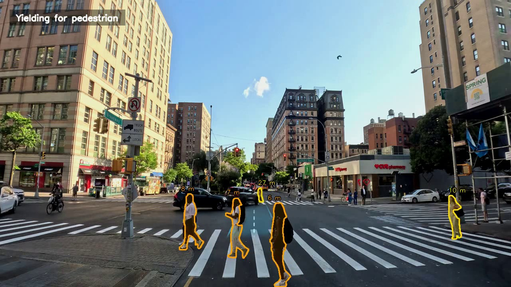
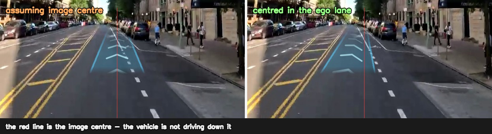
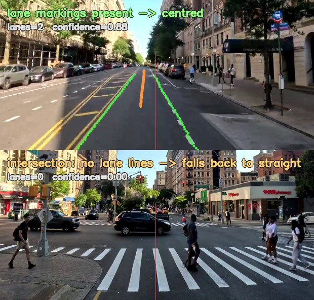
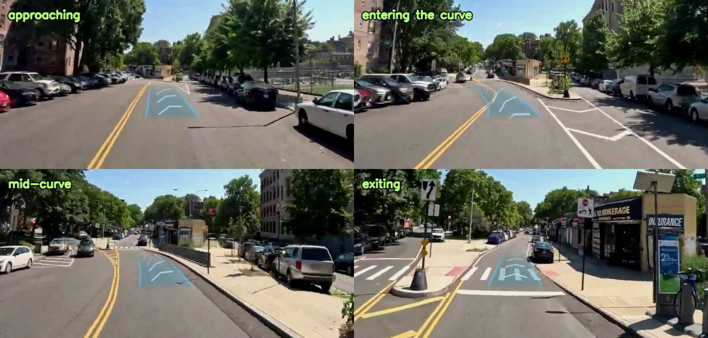
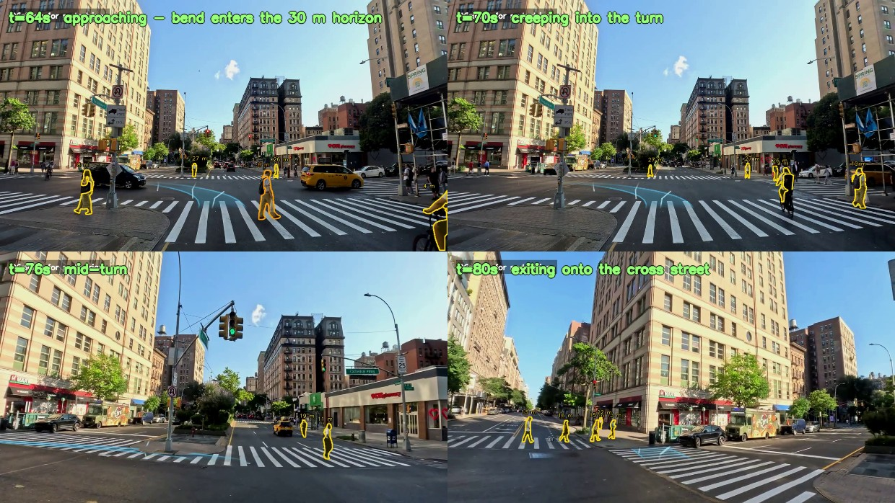
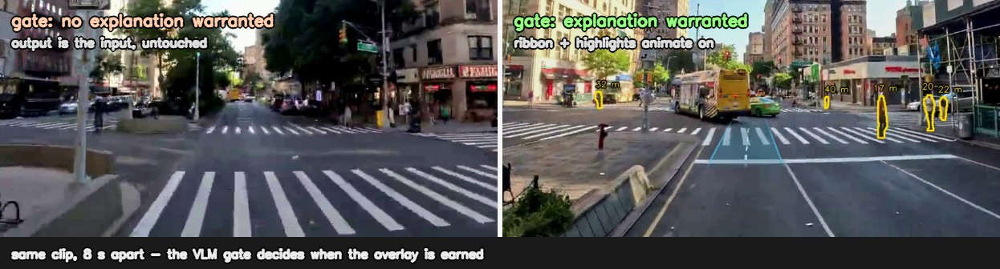
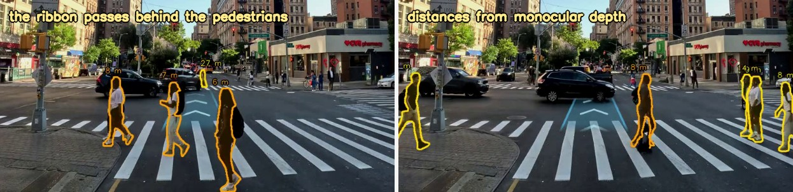
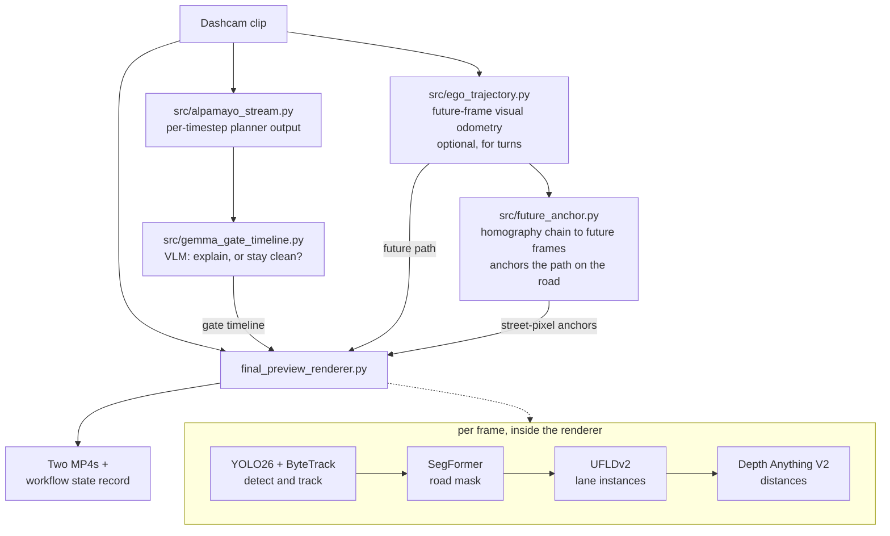
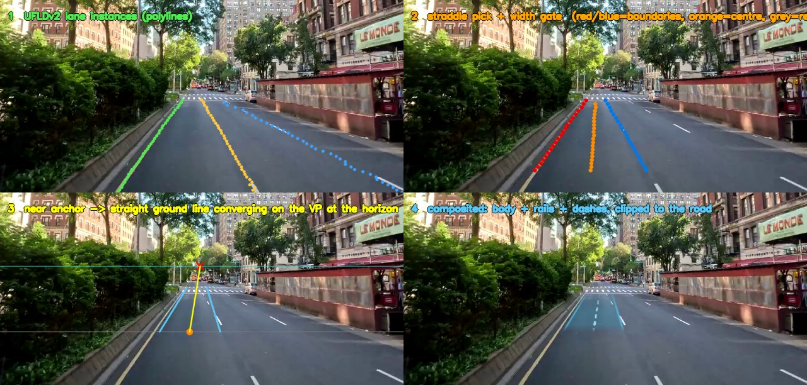

# OptiCarVis

[](https://www.python.org/downloads/)
[](https://docs.astral.sh/uv/)
[](#requirements)
[-76B900)](#requirements)

**Explainable automated-vehicle visualisations, rendered onto real dashcam footage.**

OptiCarVis takes an ordinary dashcam clip and overlays what an automated vehicle
would show a passenger to explain its behaviour: a **future-path ribbon** painted
onto the road surface, and **highlights on the road users it is reacting to**, with
distances. A vision-language model decides *when* an explanation is actually
warranted, so the overlay appears only while it earns its place on screen.



---

## Contents

- [What it produces](#what-it-produces)
- [How it looks](#how-it-looks)
- [How it works](#how-it-works)
- [What shapes the ribbon (the contract)](#what-shapes-the-ribbon-the-contract)
- [Models used](#models-used)
- [Requirements](#requirements)
- [Getting started](#getting-started)
- [Running the pipeline](#running-the-pipeline)
- [Configuration](#configuration)
- [Outputs](#outputs)
- [Known limitations](#known-limitations)
- [Further documentation](#further-documentation)

---

## What it produces

Each render writes **two videos** from one perception pass — one with pedestrians
and cyclists highlighted, one that additionally highlights vehicles — so the two
conditions can be compared in a study without re-running the models.

The overlay is composed of:

| Element | Meaning |
|---|---|
| **Cyan ribbon** | Where the vehicle is going, projected onto the road plane with correct perspective |
| **Flowing chevrons** | Direction arrowheads spaced in world metres that march forward along the path — they foreshorten like real road paint and communicate motion intent |
| **Contour highlights** | The road users the vehicle is reacting to (stable track IDs, temporally smoothed) |
| **Distance labels** | Metric distance from monocular depth, scale-aligned on the road plane |
| **Occlusion** | The ribbon passes *behind* people and vehicles, so it reads as paint on asphalt |
| **Intro / outro animation** | The ribbon draws on and retracts as an explanation starts and ends |

## How it looks

### The ribbon is centred in the ego lane, not in the image

Assuming the vehicle sits at the image centre is wrong on a multi-lane road, and
whenever it rides off-centre in its lane. Lane instances are detected and the ribbon
is anchored between the two boundaries that actually straddle the vehicle.



### Lane detection feeding the ego-lane centre

Detected lane polylines (green) and the ego-lane centre derived from the pair
straddling the vehicle (orange). At intersections there are no longitudinal
markings to follow, confidence collapses, and the ribbon falls back to straight —
by design.



### The ribbon follows a real turn

Through an intersection there are no lane lines to follow, and for a pre-recorded
clip there is no plan to read. The turn is instead reconstructed from the clip's own
future frames by visual odometry, and blended in only while a genuine turn is
detected.



The look-ahead walks the reconstructed path by **distance** (30 m), not time — a
90° turn spans the same metres at any speed, so even a slow intersection turn taken
at walking pace is anticipated and drawn. Below, a real ~80° left turn through an
intersection at ~8 km/h: the bend appears as the turn enters the horizon and the
ribbon sweeps left with the vehicle's actual path.



### The overlay only appears when it is warranted

A vision-language model gates the explanation. Self-evident situations get a clean
pass-through with no overlay at all; the visualisation is reserved for moments a
passenger would actually want explained.



### Occlusion and depth

Road segmentation clips the ribbon to the drivable surface, so it disappears behind
pedestrians instead of being painted over them, and distance labels come from
monocular depth aligned to the road plane.



---

## How it works



**Stages**

1. **Planner stream** (`alpamayo_stream.py`) — produces a per-timestep action and
   reasoning trace from perception, standing in for a live planner.
2. **Explanation gate** (`gemma_gate_timeline.py`) — runs a multimodal VLM over
   sliding windows and decides, per window, whether an explanation is warranted.
   Deliberately conservative: the default answer is *do not explain*.
3. **Ego trajectory** (`ego_trajectory.py`, optional) — planar visual odometry that
   reconstructs the vehicle's real path from the clip's future frames, so the ribbon
   can follow a genuine turn.
4. **Future anchors** (`future_anchor.py`, optional) — the clip is pre-recorded, so
   the ground the car will occupy is *visible* in its later frames. This chains
   ground-plane homographies between frames and maps the ego's near-future position
   back into every earlier frame, yielding per-frame polylines of the street pixels
   the car actually drives over. See [Anchoring the path](#anchoring-the-path-to-the-road).
5. **Render** (`render_timeline_clip.py` → `final_preview_renderer.py`) — builds the
   ribbon, highlights, occlusion and distance labels, animates the overlay on and
   off per the gate timeline, transcodes to H.264, and records the run.

## What shapes the ribbon (the contract)

Worth reading before changing anything here, because a path overlay that points
where the vehicle is **not** going is worse than no overlay at all.

How a frame becomes a ribbon — lane polylines, the straddle pick with its width
gate, the tracked anchor projected as a ground line converging on the vanishing
point, and the final composite:



| Aspect | Source | Notes |
|---|---|---|
| **Lateral placement** (near end) | Lane instances (UFLDv2) | Which lane the vehicle is in. Gated on a plausible lane width and on detection confidence; falls back to straight when unsure. |
| **Direction** | The vanishing point, at the horizon | The ribbon is the exact image of a straight ground line: its offset from the vanishing column shrinks in proportion to `(v - HORIZON_V)`, reaching zero only **at the horizon**. Because the ribbon stops short of the horizon, its far end still holds part of the near-end offset. Collapsing it onto the vanishing column at the ribbon's far end instead — or easing between the two with a smoothstep — bends the ribbon out of the ego lane toward the middle of the road. Steering the far end from the road-mask centroid or the lane detector's noisy far column had the same effect for different reasons. Do not reintroduce any of these. |
| **Curvature** | Lane-curve fit + visual odometry | Two sources, both bounded. (1) A ground-plane quadratic fitted to the two boundary polylines follows *gentle* bends when the paint is visible — its curvature is capped (R ≥ ~83 m) and measured fits on straight roads come out R = 1400–4000 m, so it cannot invent a curve. (2) Future-frame visual odometry takes over for genuine turns, where boundary coverage collapses; its look-ahead walks the reconstructed path by **distance** (30 m — a time window is blind to slow turns), and it blends in only while a real turn is detected (straight roads stay under ~2.5 m of in-window lateral spread; real turns exceed it several-fold). |
| **Stability** | Trust-gated velocity tracker | The lane anchor is an alpha-beta tracker whose gains scale with detection confidence. It tracks a *moving* lane centre without the lag of a plain EMA (which made the ribbon trail behind), and it **coasts through detection dropouts** — a crosswalk or worn paint is no new information, not evidence the lane moved to the image centre. Only a sustained lane-less stretch eases the anchor back to straight. Innovation is clamped so one bad frame cannot jerk the ribbon. |

A deliberate consequence: **gentle curves render as near-straight.** That is the
chosen trade — never confidently point somewhere the vehicle is not going.

### Anchoring the path to the road

The table above describes the *projected* sources: each reconstructs the future in
world coordinates and pushes it through the flat-ground camera model. That works on
lane-following roads and fails on real turns, for a reason no amount of tuning
fixes. A ribbon expressed as a lateral offset over a fixed forward window,
`y(x_forward)`, cannot represent an arc that folds back — a 96-degree intersection
turn reaches only ~12 m of forward distance and then curls sideways — and every
modelling error (heading noise at pull-away, calibration drift, a road that is not
flat) lands on top of that.

`future_anchor.py` removes the model from the placement entirely. The ground point
`ANCHOR_REF_AHEAD_M` ahead of the camera sits at one **fixed pixel** in every frame,
so the patch of road the car occupies at *t+k* can be carried back into frame *t*
purely by image registration:

1. Per consecutive pair, features in a road band are tracked (LK optical flow) and a
   ground-plane homography is fitted with RANSAC — moving traffic does not move like
   the road plane, so it is rejected as outliers.
2. Chains reach across time by composing hops. Keyframe hops of
   `OPTICARVIS_ANCHOR_KEYFRAME_STRIDE` frames cut a long chain to ~n/stride
   matrices, which is what keeps drift small through fast yaw; the near field keeps
   dense per-frame hops so the band stays smooth.
3. The back-projected pixels become the frame's anchor polyline, each tagged with
   its arclength ahead of the ego (from pose deltas, which carry no heading bias).

The result is that the band's vertices *are* street pixels: heading error,
calibration error and ground slope cancel by construction. A hop that loses RANSAC
consensus (a truck sweeping across the camera does this) **truncates** the chain
rather than inventing anchors, and the renderer falls back a rung.

Two implementation notes that are easy to get wrong. Rails must be offset
perpendicular to the **ground** tangent and then reprojected — offsetting
perpendicular in pixel space fans the band open into a wedge wherever the path runs
sideways across the image, because on screen "perpendicular" is partly depth and has
to foreshorten. And in planner mode the plan is drawn as a *lateral offset from the
driven path at matched arclength*, applied along the anchors, so the planner ribbon
inherits the anchors' correctness and its divergence from the human driver reads as
sideways displacement on real asphalt.

Per-frame fallback ladder, top wins:

| Rung | Source | Used when |
|---|---|---|
| 1 | Future anchors | Sidecar present and this frame has a usable polyline (short gaps are bridged) |
| 2 | Direct VO projection | No sidecar, or the chain broke here; needs a validated VO track |
| 3 | Lane-aimed ribbon | VO missing or rejected by its heading cross-check |
| 4 | Static trajectory overlay | No road mask / aimed ribbon disabled |

## Models used

Every checkpoint is named in one place — the **Models** block of
`src/pipeline_common.py` — and every one is environment-overridable, so swapping a
model never means editing the module that loads it.

| Purpose | Default model | Override |
|---|---|---|
| Detection + segmentation | `yolo26x-seg.pt` (auto-downloaded) | `OPTICARVIS_YOLO_SEG_MODEL` |
| Tracking | ByteTrack | `OPTICARVIS_TRACKER` |
| Road surface | `nvidia/segformer-b0-finetuned-cityscapes-1024-1024` | `OPTICARVIS_ROAD_SEG_MODEL` |
| Monocular depth | `depth-anything/Depth-Anything-V2-Small-hf` | `OPTICARVIS_DEPTH_MODEL` |
| Lane instances | UFLDv2 (CULane, ResNet-34) | `OPTICARVIS_UFLD_REPO` / `_WEIGHTS` — **[setup](#external-repositories)** |
| Explanation gate | `google/gemma-4-E2B-it` | `OPTICARVIS_GEMMA4_MODEL` |
| Planner | whatever `external/oom-free-alpamayo` runs | `OPTICARVIS_ALPAMAYO_MODEL` — **[see below](#swapping-the-planner-model)** |

Hugging Face weights are loaded with `local_files_only=True` so a long batch is
never stalled by Hub metadata calls. On a machine that has not cached them yet, set
`OPTICARVIS_HF_LOCAL_FILES_ONLY=0` for the first run.

Swapping `OPTICARVIS_ROAD_SEG_MODEL` for a checkpoint trained on a different label
map also means retuning `ROAD_LABEL_IDS` in `src/scene_models.py` — the default
`(0,)` is the Cityscapes road class.

### Swapping the planner model

The planner is not imported; it runs as a subprocess, so its checkpoint, CLI and
Python environment are each swappable without touching this repo. That matters
because a larger planner generally needs its own torch/transformers, which will not
be the environment the rest of the pipeline runs in.

| Variable | Effect |
|---|---|
| `OPTICARVIS_ALPAMAYO_PYTHON` | Interpreter for the planner subprocess. Defaults to the current one — set it to the planner venv's python |
| `OPTICARVIS_ALPAMAYO_MODEL` | Passed through as `--model <id>`. Only passed when set, since a backend that does not accept the flag would reject it |
| `OPTICARVIS_ALPAMAYO_SCRIPT` | The script to run. Defaults to `<repo>/scripts/infer_crowd_clip.py` |
| `OPTICARVIS_ALPAMAYO_CONFIG` | Backend config file (default `config_5080_16gb.json`) |
| `OPTICARVIS_ALPAMAYO_EXTRA_ARGS` | Extra CLI arguments, split shell-style and appended verbatim |

For example, pointing at [`nvidia/Alpamayo2-Super`](https://huggingface.co/nvidia/Alpamayo2-Super)
running from its own environment:

```bash
export OPTICARVIS_ALPAMAYO_PYTHON=/opt/alpamayo2/.venv/bin/python
export OPTICARVIS_ALPAMAYO_REPO=/opt/alpamayo2
export OPTICARVIS_ALPAMAYO_SCRIPT=/opt/alpamayo2/scripts/infer.py
export OPTICARVIS_ALPAMAYO_MODEL=nvidia/Alpamayo2-Super
export OPTICARVIS_ALPAMAYO_EXTRA_ARGS="--dtype bf16 --diffusion-steps 10"
```

The interpreter path is passed through verbatim, so a POSIX path works when the
batch runner itself is driven from Windows.

> **Note** — the wrapper controls *how* the planner is invoked, not what its CLI
> accepts. A backend whose flags differ from `--clips / --output-dir / --config`
> needs its own wrapper script; point `OPTICARVIS_ALPAMAYO_SCRIPT` at that. Check
> the backend's own hardware requirements before committing to it: Alpamayo2-Super
> is 34B and was profiled at ~72 GiB peak device memory on an H100 80 GB.

## Requirements

- Python **3.12**, [`uv`](https://docs.astral.sh/uv/)
- An NVIDIA GPU is strongly recommended — the renderer runs four models per frame.
  Developed on an RTX 5080 (Blackwell, `sm_120`), which needs a **CUDA 12.8** build
  of PyTorch. `uv sync` handles this; see below.
- `ffmpeg` on `PATH` for the H.264 delivery encode. Without it the render still
  completes and keeps the `mp4v` master, with a warning.

### How PyTorch is resolved

PyPI's Windows `torch` wheel is **CPU-only** — its CUDA dependencies are gated on
`sys_platform == 'linux'`, so a plain PyPI install silently yields a CPU build and
every CUDA kernel launch fails. `pyproject.toml` therefore routes Windows to the
CUDA 12.8 index while leaving Linux on PyPI, whose wheels do bundle CUDA for both
`x86_64` and `aarch64`:

| Platform | Resolves to | CUDA |
|---|---|---|
| Windows `x86_64` | `torch 2.11.0+cu128` from `download.pytorch.org/whl/cu128` | 12.8 |
| Linux `x86_64` / `aarch64` | `torch 2.13.0` from PyPI | 13.0 (bundled) |

Nothing extra to install — `uv sync --frozen` is enough on both.

Linux is left on PyPI **on purpose**, and not because the CUDA 12.8 index lacks ARM
builds — it does publish `manylinux_2_28_aarch64` wheels. That is exactly what makes
the alternative dangerous: pinning `aarch64` to `cu128` would resolve *cleanly* and
look correct, while installing a CUDA 12.8 build. From torch 2.11.0 onward the PyPI
Linux wheels are **CUDA 13.0** builds, which is what an **sm_121** part such as DGX
Spark's GB10 wants. Sending Spark to the `cu128` index would silently hand it
kernels built for the wrong architecture generation.

## Getting started

**1. Install `uv`**

```bash
curl -LsSf https://astral.sh/uv/install.sh | sh
```

```powershell
irm https://astral.sh/uv/install.ps1 | iex
```

**2. Clone and sync**

```bash
git clone https://github.com/Shaadalam9/opticarvis
cd opticarvis
uv python install 3.12.13
uv sync --frozen
```

**3. Activate the environment**

```bash
source .venv/bin/activate
```

```powershell
.\.venv\Scripts\Activate.ps1
```

This installs the full pipeline, PyTorch included — see
[How PyTorch is resolved](#how-pytorch-is-resolved) for what each platform gets.

### Directory layout

Every path is derived from the repository root, so a fresh clone needs no path edits.
Three directories are **gitignored and not present after cloning**:

```
opticarvis/
    src/                  pipeline code (tracked)
    videos/               source dashcam videos          <- you provide
    mapping.csv           clip index (tracked)
    external/             upstream checkouts             <- you clone, see below
        alpamayo/
        oom-free-alpamayo/
        UFLDv2/
    alpamayo_outputs/     extracted clips + planner JSON <- created by the pipeline
    workflow_outputs/     renders, timelines, state      <- created by the pipeline
```

`alpamayo_outputs/` and `workflow_outputs/` are created on demand — nothing to do.
They are ignored because they hold multi-gigabyte video artefacts. `videos/` is
ignored for the same reason; the batch runner will fetch missing source videos over
FTP when credentials are configured.

### Fetching every model at once

```bash
.venv/bin/python scripts/setup_assets.py                 # download what is missing
.venv/bin/python scripts/setup_assets.py --check-only    # report, change nothing
.venv/bin/python scripts/setup_assets.py --with-planner  # also the ~67 GB planner checkpoint
```

This exists because the worst missing-asset failure is not a crash: without the
UFLDv2 lane model the renderer silently falls back to a straight in-lane ribbon
and a whole batch completes looking plausibly wrong. `scripts/run_100_cities.sh`
runs the check before starting and refuses to launch with required assets
missing. The sections below describe the same assets for manual setup.

### External repositories

The pipeline shells out to two upstream checkouts and loads a third as a library.
None are vendored — clone them into `external/`, which is where every default path
looks:

```bash
mkdir -p external
git clone --depth 1 https://github.com/NVlabs/alpamayo.git external/alpamayo
git clone --depth 1 https://github.com/aveeslab/oom-free-alpamayo.git external/oom-free-alpamayo
git clone --depth 1 https://github.com/cfzd/Ultra-Fast-Lane-Detection-v2.git external/UFLDv2
```

Only `batch_corrected_pipeline.py` needs the two Alpamayo checkouts, and only to
generate planner JSON; rendering from existing JSON does not. Each location is
overridable — see [Configuration](#configuration).

**Lane detection weights (optional).** Ego-lane centring needs the UFLDv2 CULane
checkpoint, which is ~865 MB and gitignored:

```bash
uv pip install gdown addict pathspec
python -c "import gdown; gdown.download(id='1AjnvAD3qmqt_dGPveZJsLZ1bOyWv62Yj', output='external/UFLDv2/culane_res34.pth')"
```

Without it the renderer still runs: it reports that the lane model is unavailable and
keeps the ribbon straight ahead in the lane.

## Running the pipeline

**Build the explanation-gate timeline**

```bash
python src/gemma_gate_timeline.py <clip.mp4> gate_timeline.json 6.0
```

**Render** — the tag becomes part of the output filename:

```bash
python src/render_timeline_clip.py <clip.mp4> gate_timeline.json lanecenter
```

**Render with turn following** — reconstruct the path first, then enable it:

```bash
python src/ego_trajectory.py <clip.mp4> vo_traj.json 4.0
```

```bash
OPTICARVIS_VO_TRAJECTORY=1 python src/render_timeline_clip.py <clip.mp4> gate_timeline.json hybrid "" vo_traj.json
```

Pass `""` to skip an optional argument slot. Supplying a track file while its flag is
unset is ignored **with a warning**, rather than silently.

**Tune the camera calibration** on a single still, with no video or models loaded:

```bash
python src/final_preview_renderer.py --calibrate frame.jpg calib.png
```

This draws the horizon, the vanishing point and metre distance ticks so `HORIZON_V`,
`VANISH_U`, `CAM_FOCAL_PX` and `CAM_HEIGHT_M` can be set by eye.

### Restyling a render without re-rendering

The cost of a render is the four models per frame, not the drawing — so the
renderer dumps the geometry those models produced (per-frame ribbon centreline,
selected detections, animation ramp, occlusion map) to
`workflow_outputs/overlay_geometry/` while it renders (`OPTICARVIS_DUMP_GEOMETRY`,
on by default). Any overlay style can then be re-composited from that in seconds
on CPU:

```bash
python src/restyle_render.py \
    --geometry workflow_outputs/overlay_geometry/<tag>_geometry.jsonl.gz \
    --style styles/default.json
```

Styles are per-element JSON (`styles/default.json` reproduces the built-in
look): colour, opacity, blur/feather, stroke widths and visibility for the
ribbon, chevrons, pedestrians, vehicles, distance labels and the explanation
panel — plus parameters that shape geometry derived from the centreline, such
as the ribbon width and chevron spacing/speed. Pixel values are at the 1280x720
calibration reference and scale with the clip exactly as the renderer's do.

The compositor calls the renderer's own drawing functions with the style values
substituted, so the default style reproduces the shipped look by construction.
What it cannot change is anything the models or temporal trackers decided —
which objects are highlighted, where the ribbon goes, when the overlay is on.
That is the point: style variants from identical geometry are clean
experimental conditions.

## Configuration

Every path and clip selection is environment-overridable, so rendering a second clip
needs no code edits.

| Variable | Default | Effect |
|---|---|---|
| `OPTICARVIS_PROJECT_ROOT` | the repo root (from `__file__`) | Base for every path below |
| `OPTICARVIS_VIDEOS_DIR` | `<root>/videos` | Source dashcam videos |
| `OPTICARVIS_WORKFLOW_OUTPUTS` | `<root>/workflow_outputs` | Renders, timelines, workflow state |
| `OPTICARVIS_ALPAMAYO_OUTPUTS` | `<root>/alpamayo_outputs` | Extracted clips and planner JSON |
| `OPTICARVIS_EXTERNAL_DIR` | `<root>/external` | Parent of the upstream checkouts |
| `OPTICARVIS_ALPAMAYO_REPO` | `<external>/alpamayo` | NVlabs Alpamayo checkout |
| `OPTICARVIS_OOM_FREE_ALPAMAYO_REPO` | `<external>/oom-free-alpamayo` | Checkout providing `infer_crowd_clip.py` |
| `OPTICARVIS_UFLDV2_DIR` | `<external>/UFLDv2` | UFLDv2 checkout |
| `OPTICARVIS_VIDEO_ID` | `TuCsyBF3nHU` | Clip identity for per-clip artefacts |
| `OPTICARVIS_SEGMENT_START_S` | `4630` | Segment start, used in artefact names. `OPTICARVIS_SEGMENT_START_TIME_S` is accepted as a legacy alias |
| `OPTICARVIS_CLIPS_PER_CITY` | `1` | Rendered clips wanted per city. `0` removes the cap and falls back to the footage budget |
| `OPTICARVIS_WINDOWS_PER_CITY` | `CLIPS_PER_CITY` | Candidate windows tried per city, in stride order, until the Gemma gate approves one. The gate defaults to `do_not_explain`, so first windows frequently yield no video |
| `OPTICARVIS_GATE_BATCH` | `1` | Decide the gate for a whole window round in one process (loads Gemma once) instead of once per clip. `0` restores the per-job gate |
| `OPTICARVIS_REQUIRE_GEMMA_GATE` | `0` | `1` makes a Gemma load failure an error instead of a silent fallback to the heuristic gate. Set it for batch runs |
| `OPTICARVIS_BATCH_H264` | `1` | Re-encode each rendered mp4v master as H.264 in place. `0` keeps the masters |
| `OPTICARVIS_MAX_CONSECUTIVE_FAILURES` | `5` | Stop the batch after this many consecutive job failures with no success between (systemic-failure guard). `0` disables |
| `OPTICARVIS_STOP_ON_JOB_FAILURE` | `0` | `1` stops the batch at the first failed job (debugging) |
| `OPTICARVIS_DUMP_GEOMETRY` | `1` | Dump per-frame overlay geometry during renders for post-hoc restyling (`src/restyle_render.py`). `0` disables — and forfeits cheap restyles for those clips |
| `OPTICARVIS_RIBBON_SOURCE` | `perception` | `perception` shows where the vehicle will actually drive (lane centering + validated, calibrated VO) — the deliverable ribbon. `planner` draws Alpamayo's intended trajectory, world-anchored and advanced by real ego motion; on human-driven footage it visibly diverges from the driven road, so treat it as a labeled experimental condition |
| `OPTICARVIS_PLANNER_LATERAL_SIGN` | `-1` | Alpamayo's ego frame is FLU (+y left); the renderer is right-positive. `-1` converts; changing it mirrors every planned turn |
| `OPTICARVIS_AUTO_CALIBRATE` | `1` | Estimate each clip's vanishing point/horizon (`src/auto_calibrate.py`) before the planner, VO and renderer consume the camera constants. An untrusted estimate writes nothing and the defaults hold |
| `OPTICARVIS_CALIBRATION_DIR` | `<workflow_outputs>/calibration` | Where the planner wrapper looks for per-clip calibration files (set for the adapter subprocess by the batch) |
| `OPTICARVIS_CITY_LIMIT` | `100` | Cities read from `mapping.csv` |
| `OPTICARVIS_CITY_FOOTAGE_S` | `3600` | Secondary per-city budget. It accrues `STRIDE_S` per clip, not `CLIP_LENGTH_S`, so it is a poor way to ask for *n* clips — use `OPTICARVIS_CLIPS_PER_CITY` |
| `OPTICARVIS_CLIP_LENGTH_S` | `30` | Clip length in seconds |
| `OPTICARVIS_STRIDE_S` | `60` | Gap between successive clip starts within a city |
| `OPTICARVIS_LANE_SOURCE` | `ufldv2` | `ufldv2` (lane instances) or `yolop` (lane mask) |
| `OPTICARVIS_LANE_CURVE` | `1` | `0` disables the lane-curve fit (ribbon stays straight-in-lane) |
| `OPTICARVIS_VO_TRAJECTORY` | `0` | `1` blends the VO path in through genuine turns |
| `OPTICARVIS_FUTURE_ANCHOR` | `1` | Trace the driven path onto the actual street pixels by chaining ground homographies to the future frames (`src/future_anchor.py`, runs after the VO stage). `0` renders from the projected VO path instead. See [Anchoring the path](#anchoring-the-path-to-the-road) |
| `OPTICARVIS_ANCHOR_REF_AHEAD_M` | `4.5` | Ground distance ahead of the camera whose fixed pixel is carried back from each future frame |
| `OPTICARVIS_ANCHOR_KEYFRAME_STRIDE` | `8` | Frames per keyframe hop; longer hops mean fewer matrix compositions and less chain drift, at coarser sampling |
| `OPTICARVIS_ANCHOR_MIN_INLIER_RATIO` | `0.5` | RANSAC inlier floor per hop. Below it the chain truncates rather than fabricating anchors |
| `OPTICARVIS_FUTURE_ANCHOR_JSON` | — | Read anchors from an explicit path (manual runs outside the batch layout) |
| `OPTICARVIS_EGO_LOOKAHEAD` | `0` | Legacy phase-correlation look-ahead; superseded by VO |
| `OPTICARVIS_UFLD_REPO` / `_WEIGHTS` | local paths | UFLDv2 checkout and checkpoint |
| `OPTICARVIS_GATE_REASONING` | — | Override the planner reasoning trace (testing) |

Model selection is listed separately under [Models](#models-used); the planner
backend under [Swapping the planner model](#swapping-the-planner-model).

## Outputs

Written to `<PROJECT_ROOT>/workflow_outputs/final_renders/`, named after the clip
that was rendered so clips cannot overwrite one another:

```
<clip>_roadline_v3_<tag>_h264.mp4            # pedestrians + cyclists highlighted
<clip>_roadline_v3_<tag>_vehicles_h264.mp4   # + vehicles highlighted
```

Each render also appends a record to the clip's workflow-state JSON with the inputs,
frame counts, and the **effective configuration** (lane source, VO and look-ahead
flags, thresholds, `OPTICARVIS_*` values) — so a shipped video can be traced back to
the settings that produced it. Output paths that no longer exist are pruned from the
state on each run.

## Known limitations

- **Curves need evidence.** Gentle bends are followed only while both lane
  boundaries are visible (the curve fit decays to straight otherwise), and sharp
  turns only while visual odometry confidently detects them — see
  [the contract](#what-shapes-the-ribbon-the-contract). A bend with no visible
  paint and no VO confidence renders as straight, by design.
- **Turn following is validated on real data at two speeds**: a moderate curve at
  ~26 km/h and a sharp (~80°) intersection turn taken at ~8 km/h. The look-ahead is
  distance-based (30 m) precisely so that slow turns are not missed — a time-based
  window is blind to them.
- **Visual odometry is monocular and planar.** It assumes flat ground and the
  configured calibration; it estimates path *shape* well, not survey-grade motion.
- **Calibration is per-camera.** The defaults are tuned for one 1280×720 dashcam;
  re-tune with `--calibrate` for other footage or the ribbon will sit wrong. In
  particular the ribbon's direction is only correct if `VANISH_U` / `HORIZON_V`
  really are the road's vanishing point for your camera.

## Further documentation

- **[docs/ENGINEERING.md](docs/ENGINEERING.md)** — the measured evidence behind
  every geometry/tracking decision (with figures): why the ribbon is a straight
  ground line, why the anchor coasts through dropouts, the visual-odometry sign
  and look-ahead lessons, the jitter budget, and the measurement methods to
  reuse. Read it before changing the renderer.
- **[AGENTS.md](AGENTS.md)** — operating manual for coding agents (and new
  contributors): environment facts, repo map, render commands, and the
  invariants that must not be broken.

## Licence

See [LICENSE](LICENSE).
