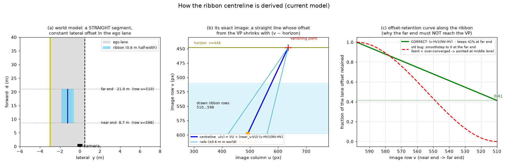
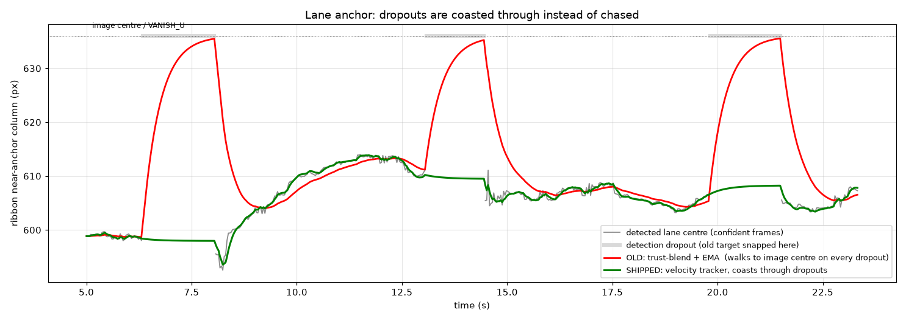
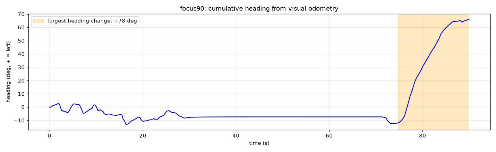
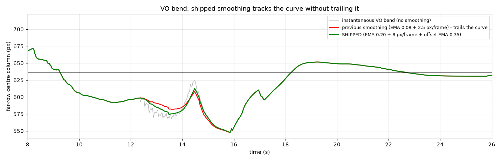
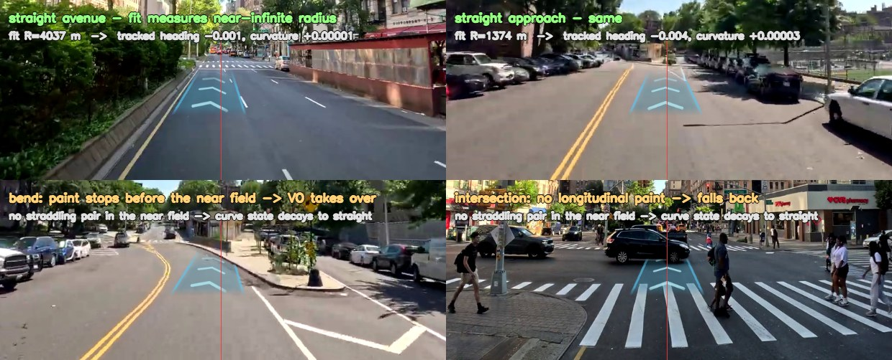

# Engineering notes — the measured decisions behind the ribbon

This file records *why* the renderer is built the way it is, with the measurements
that forced each decision. Read it before changing `src/final_preview_renderer.py`
geometry or tracking, or `src/ego_trajectory.py`. Every rule here was paid for with a
shipped defect; the figures are the evidence.

The user-facing summary of these rules is the
["What shapes the ribbon" contract](../README.md#what-shapes-the-ribbon-the-contract)
in the README. This file is the long form.

---

## 1. The ribbon is the exact image of a straight ground line

**Model** *(a)*: the ribbon is a straight segment on the road plane at the ego
lane's lateral offset, spanning ~8.7 m to ~21 m ahead.

**Projection** *(b)*: under the flat-ground pinhole
(`u = VANISH_U + f·y/d`, `v = HORIZON_V + f·h/d`), that segment images as a
**straight line converging on the vanishing point at the horizon**. Its offset
from the vanishing column shrinks in proportion to `(v − HORIZON_V)` — implemented
in `perspective_profile()`.

**The bug this replaced** *(c)*: interpolating near→far with a smoothstep and
collapsing onto the vanishing column **at the ribbon's far end** (rather than at
the horizon). The ribbon stops well short of the horizon, so its far end must
retain ~41 % of the near-end offset; forcing it to zero early pulled the far end
~31 px toward the image centre and the smoothstep bowed the middle ~15 px — on a
multi-lane road the ribbon visibly drifted into the neighbouring lane.

**Rules.** Any centreline construction must (1) reduce to the exact straight
ground line when heading/curvature are zero — assert `≤ 0.01 px` deviation against
`VANISH_U + (near_u − VANISH_U)·(v − HORIZON_V)/(near_v − HORIZON_V)` — and
(2) never aim the far end using the road-mask centroid (drifts to the street
centre on multi-lane roads) or the lane detector's far column (noisy; tilts the
ribbon off the true path).

## 2. The lane anchor coasts through detection dropouts

The lane detector (UFLDv2 instances → straddle pick → width gate) drops out for
~1.5 s at crosswalks, worn paint and dashed-line gaps. The original logic blended
the target toward `VANISH_U` by detection trust — which turned every dropout into
"the lane centre is the image centre". The measured target was a **square wave**,
and the smoother chased it: the ribbon walked to the image centre and back every
few seconds (the red curve). This also *felt* like the ribbon trailing the car.

`resolve_lane_center` is now an alpha-beta tracker (position + velocity) with
trust-scaled gains:

- confident detection → update toward the **full** measured offset (low trust
  means *weigh it less*, never *bias it toward a prior*);
- dropout → **coast** (hold course, decay velocity) — a missing detection is no
  new information;
- sustained dropout (`LANE_HOLD_FRAMES`, ~2.5 s) → ease gently to straight.

Measured on a recorded 550-frame series: tracking error 3.2 → 0.4 px, output
jitter 0.68 → 0.24 px, and the anchor stays inside the real lane's range. A plain
EMA also lags a *moving* lane centre by ~8 frames (its ramp lag); the velocity
state removes that.

## 3. Visual odometry: three hard-won rules

### 3a. The lateral sign convention

`src/ego_trajectory.py` integrates the path in the standard vehicle frame
(+yaw/+Y = **left**); the renderer's `project_ground_point` is
**right-positive** (`LATERAL_SIGN = +1`). `future_trajectories` negates lateral
on output and stamps `"lateral_convention": "right_positive"` into the track.
When this was wrong, **every VO-shaped turn rendered mirrored** — a left turn
drew the ribbon into oncoming traffic, at full blend weight (the turn detector
uses `abs()`, so it saturates exactly when the error is worst).

**Verification protocol — never judge turn direction by eye** (that check passed
once while the sign was inverted): (1) `cv2.phaseCorrelate` the scene over ~4 s —
features sliding right ⇒ the camera yaws left; compare against the projected
far-end column vs `VANISH_U`. (2) A synthetic `psi = linspace(0, +60°)` path must
emit negative lateral and project left of the vanishing column.

### 3b. Yaw must subtract translational parallax

Reading yaw from raw horizontal flow is ~89 % translational parallax on a
straight road — it fabricated phantom turns. `estimate_motion` predicts each
ground feature's translational shift from the forward step and its known depth
(`(u − VANISH_U)·step/d`), subtracts it, and takes the median of the rotational
residual. On a genuine turn the naive and corrected estimates agree (+25.9° vs
+26.3°); on straights the corrected one is quiet.

### 3c. Look-ahead is distance, not time

A 4-second look-ahead at crawling speed covers < 9 m — a genuine ~78° intersection
turn taken at ~8 km/h produced almost no lateral displacement inside the window
and the path never reached the ribbon's drawn range. The pipeline declared the
clip turn-free; **the user knew the turn was there and was right.** A turn is a
property of the path, not of how fast it is driven: `future_trajectories` now
walks `LOOKAHEAD_M = 30 m` of path (time-capped at 20 s). Validated: the turn
weight fires in exactly one cluster (t = 63.0–83.6 s, peak 1.00 — engaging as the
turn enters the 30 m horizon, which is anticipation, not a false positive) and
zero false fires elsewhere.

When a scan concludes "the footage does not contain X" and a human says it does,
re-examine the metric before the footage.

### 3d. VO blend guards

- The projected VO rows must **span the ribbon's rows**; otherwise `np.interp`
  clamps every row to one column and the near-anchor shift cancels the bend
  exactly — a dead-vertical ribbon while reporting full VO weight. Coverage is
  checked and partial coverage tapers the weight.
- `vo_turn_weight` measures lateral spread **only over points projecting into
  the ribbon's row window** — a curve beyond the drawn ribbon must not saturate
  the weight.
- Path thinning is by **arc length**, and the forced last sample was removed:
  thinning by forward distance discarded a turn's post-apex arc and the spliced
  endpoint drew a straight chord across the missing curve (~1700 px far-end
  shear on a synthetic 90° turn).
- The applied offsets are EMA-smoothed and rate-clamped per row
  (`VO_OFFSET_SMOOTH`, `VO_MAX_STEP_PX`); the weight EMA is `VO_WEIGHT_SMOOTH`.
  At the previous heavier smoothing the drawn bend trailed the real curve by
  ~0.4 s and stopped ~15 px shy of full depth (figure above).

## 4. Gentle curves: the lane-curve fit

`fit_lane_curve` unprojects the two straddling boundary polylines to the road
plane and fits a distance-weighted robust quadratic to their midline; the tracked
heading/curvature feed the ribbon baseline. Bounded by construction: curvature
capped at `LANE_CURVE_MAX_K` (R ≥ ~83 m), and measured fits on straight roads
come out R = 1400–4000 m — it cannot invent a curve. Where the boundaries do not
span the near field the state decays to straight; boundary coverage collapses
exactly where sharp curvature lives, which is why **VO owns real turns** and this
fit only handles gentle, visibly-painted bends.

## 5. The jitter budget

Decomposing far-row wiggle on recorded turn-clip data (second-difference std):

| Configuration | Far-row wiggle | Peak frame step |
|---|---|---|
| Shipped before | 2.15 px | 15.1 px |
| Anchor only | 0.69 px | — |
| + lane-curve state | 1.42 px ← dominant source | 12 px slams at redetects |
| + VO | negligible | — |
| **Final** (21 m ribbon, curve gain 0.08 + step clamps, VO EMA) | **0.83 px** | **6.4 px** |

The fixes: ribbon shortened 27 → 21 m (the far field amplifies everything and the
last 6 m added little information), curve gain calmed with per-frame step clamps
(`LANE_CURVE_STEP_H/K` — a dropout→redetect used to slam a fresh fit in at full
gain), VO offsets EMA'd. The bend still acquires within ~0.5 s.

## 6. Compositing

Layer alpha comes from real **coverage masks**, never from the fill colour's
luminance. The old luminance path coupled opacity to the colour choice
(`BODY_ALPHA` 0.42 actually rendered at 0.28; rails and dashes disagreed while
sharing one constant; blurred edges faded toward black instead of transparent).
The constants were reset to the previously-*effective* values, so appearance was
preserved while the numbers became honest. Chevrons are drawn into the same
coverage layer, spaced in world metres with the phase advanced per frame
(`CHEVRON_SPEED_MPS`), so they foreshorten like road paint and flow forward.

## 7. Measurement methods worth reusing

- **Record, then replay.** Capture per-frame measurements (lane centre, fits,
  confidences) once with the GPU, then iterate on tracker/geometry constants
  offline against the recording. Every tuning above was done this way.
- **Second difference for jitter** (`std(x[2:] − 2x[1:-1] + x[:-2])`): isolates
  frame-to-frame wiggle from genuine motion.
- **Straight-case equivalence** for any geometry change: zero curve state must
  reproduce the exact straight ground line to numerical precision.
- **Ground-truth turn direction** with phase correlation, never by eye (§3a).
- **Localize before concluding.** "Weight fires on the straight section" turned
  out to be legitimate anticipation frames just before an arbitrarily-drawn
  boundary. Cluster the firing frames in time and look at what is actually there.
